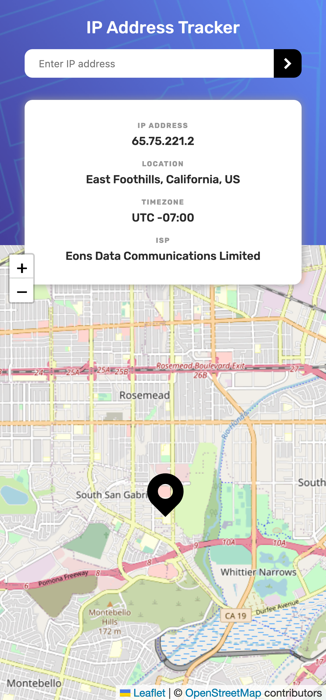

# Frontend Mentor - IP address tracker solution

This is a solution to the [IP address tracker challenge on Frontend Mentor](https://www.frontendmentor.io/challenges/ip-address-tracker-I8-0yYAH0). Frontend Mentor challenges help you improve your coding skills by building realistic projects. 

## Table of contents

- [Overview](#overview)
  - [The challenge](#the-challenge)
  - [Screenshot](#screenshot)
  - [Links](#links)
- [My process](#my-process)
  - [Built with](#built-with)
  - [What I learned](#what-i-learned)
  - [Continued development](#continued-development)
  - [Useful resources](#useful-resources)
- [Author](#author)

## Overview

### The challenge

Users should be able to:

- View the optimal layout for each page depending on their device's screen size
- See hover states for all interactive elements on the page
- See their own IP address on the map on the initial page load
- Search for any IP addresses or domains and see the key information and location

### Screenshot
<table>
    <tr>
        <td>
            
        </td>
    </tr>
    <tr>
        <td>
            
        </td>
    </tr>
</table>

### Links

- Solution URL: [here](https://your-solution-url.com)
- Live Site URL: [here](https://zun-liang.github.io/ip-address-tracker/)

## My process

### Built with

- Semantic HTML5 markup
- CSS custom properties
- Flexbox
- Mobile-first workflow
- [React](https://reactjs.org/) - JS library
- [Styled Components](https://styled-components.com/) - For styles

### What I learned

- How to setup and use Leaflet in React
- How to use useEffect when calling APIs
- How to set up an easy loading / error screen

### Continued development

- React router
- React context
- React custom hooks
- render props
- unit testing
- styled-components

### Useful resources

- [useUpdateEffect](https://usehooks-ts.com/react-hook/use-update-effect)
- [HTTP response status codes](https://developer.mozilla.org/en-US/docs/Web/HTTP/Status)
- [react-error-boundary](https://github.com/bvaughn/react-error-boundary)
- [React Leaflet](https://react-leaflet.js.org/)
- [Essential setup steps to use React-Leaflet](https://zhiqiyu.github.io/post/react-leaflet-setup/)
- [React Leaflet styled-components](https://codesandbox.io/s/react-leaflet-styled-components-j436d)
- [How to Fetch Data in React: Cheat Sheet + Examples](https://www.freecodecamp.org/news/fetch-data-react/)

## Author

- Website - [Zun Liang](https://zun-liang.github.io/)
- Frontend Mentor - [@zun-liang](https://www.frontendmentor.io/profile/zun-liang)

